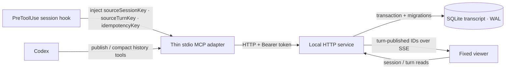

# Design and Migration

## Goals and boundaries

Semantic Answer Tree is a local, append-only transcript of semantic answers. It is not a chat system or a cloud document store. The public answer format remains `SemanticAnswer` schema v1. Sessions, turns, request summaries, identity, idempotency, storage, and transport are surrounding protocol concerns and must not be added to the answer document.

Core invariants:

- One `sourceSessionKey` maps to one viewer session.
- Each successful publication appends exactly one immutable turn. Turns are never updated or deleted in place.
- The SQLite transaction commits before the durable acknowledgement and the `turn-published` notification.
- Within a session, submitting the same `idempotencyKey` with the same envelope returns the original acknowledgement. It does not append another turn or emit the event again.
- After a successful publication, the viewer is the only answer surface. If publication cannot be confirmed, Codex falls back to a normal answer in the conversation.

## Components



The local HTTP service is the only process that owns a SQLite connection, schema migrations, runtime validation, legacy import, and event delivery. The MCP server only translates stdio tool calls into authenticated HTTP requests; it never opens the database directly.

The HTTP service always binds to `127.0.0.1`. It is a single-user local viewer: a Bearer token protects publication and the agent's compact-history lookup, while the viewer's session list, full-turn reads, and SSE endpoint do not require a token. A session is an organizational unit, not a tenant or authorization boundary. Any process that can directly reach the loopback service on the local machine can read the complete transcript.

## SQLite model

The implementation uses Node.js's built-in `node:sqlite`, so it has no native add-on dependency. The current engine requires Node.js `>=22.13.0`. Some Node.js versions may print a `node:sqlite` experimental warning; this warning does not mean that a migration or data write failed.

Database startup configures:

- `PRAGMA foreign_keys = ON`;
- `PRAGMA busy_timeout = 5000`;
- `PRAGMA journal_mode = WAL`;
- `PRAGMA synchronous = FULL`.

Primary records:

| Record | Purpose |
| --- | --- |
| `sessions` | Identifies a transcript by its unique `source_session_key` and stores its title and time metadata. |
| `turns` | Appends the request summary, canonical answer JSON, hash, source turn, and idempotency data under a monotonically increasing per-session `sequence`. |
| `event_log` | Stores committed `turn-published` identifiers for SSE reconnection and replay. |
| `legacy_imports` | Records each imported legacy file's absolute path and content hash to prevent duplicate imports. |
| `schema_migrations` | Records the version, file name, and time of each successfully applied migration. |

Database triggers on `turns` reject `UPDATE` and `DELETE`. Unique constraints also protect the per-session sequence, the per-session idempotency key, and every nonempty `sourceTurnKey`.

SQLite stores request summaries and canonical answer JSON as plaintext. The append-only constraint provides historical integrity, not encryption at rest. The runtime directory must still be protected by the operating system's user boundary.

## Writes, reads, and events

The publication service first validates, canonicalizes, and hashes the complete envelope. It then enters a `BEGIN IMMEDIATE` transaction, finds or creates the session, checks idempotency, allocates the next sequence, writes the turn and event-log entry, and commits. A successful acknowledgement contains only:

```json
{
  "ok": true,
  "sessionId": "...",
  "turnId": "...",
  "sequence": 1
}
```

An SSE connection first emits `ready`, followed by `turn-published` events and heartbeats. A `turn-published` payload contains only `eventId`, `sessionId`, `turnId`, and `sequence`; it does not carry the answer body. The viewer reads the immutable turn by ID. On reconnection, a known event ID can be used to replay at most 100 subsequent committed events. An unknown ID does not trigger a replay.

When an agent reads context, it starts with compact history: `roots` retains only the root, while `frontier` also includes one level of child resolutions. The agent reads one full turn only when the compact information is insufficient. The system does not automatically load large spans of history.

A compact root contains `content`, `childCount`, and, in `frontier` mode, an optional single level of `children`. The accompanying `answer.terms` contains only the definitions actually referenced by those nodes.

## Session identity

A normal stdio MCP configuration defines only the command, arguments, environment, and working directory. The official MCP documentation does not state that it automatically adds the current Codex thread ID to every tool's arguments. Consequently, conversation identity must not be inferred from the stdio process, PID, working directory, browser tab, or the "latest session." [Codex MCP documentation](https://learn.chatgpt.com/docs/extend/mcp?surface=cli)

The preferred solution is the bundled `integration/codex-session-hook.mjs`. The repository does not install `hooks.json`; the user must configure and trust the hook manually, using absolute paths to Node and the script. The Codex `PreToolUse` hook can read the common `session_id`, the turn-scoped `turn_id`, and the MCP `tool_input`, then replace the arguments through `updatedInput`. [Codex Hooks documentation](https://learn.chatgpt.com/docs/hooks)

The hook derives:

- `sourceSessionKey = "codex:" + session_id`;
- `sourceTurnKey = turn_id`;
- `idempotencyKey = SHA-256("codex:" + session_id + ":" + turn_id)`.

The `codex:` namespace prevents collisions with manual bindings. The hook injects identifiers only; it does not read or upload the full transcript.

When using an App Server wrapper, use the stable `thread.id` as the conversation key and `turn.id` as the turn key. Do not use `thread.sessionId` as the fork identity: the official documentation states that a fork receives a new `thread.id`, while a persisted fork retains the root's `thread.sessionId`. [Codex App Server documentation](https://learn.chatgpt.com/docs/app-server)

Only when neither the hook nor a wrapper is available should each conversation receive an explicitly configured, unique `SEMANTIC_ANSWER_SESSION_KEY`. This is a manual binding; it does not change automatically with a Codex thread or fork.

## Capability token

Writes and agent history reads are authorized with `Authorization: Bearer <token>`. `SEMANTIC_ANSWER_TOKEN` takes precedence over the token file. When no token is supplied directly, the service reads `SEMANTIC_ANSWER_TOKEN_FILE` or atomically creates a random token at the default `.semantic-answer/capability-token` path.

The token must contain at least 32 non-whitespace characters. Never place it in an answer, request summary, log, repository, or hosted bundle. Prefer configuring the HTTP service and MCP adapter to share the same absolute token-file path.

## Migrations and legacy import

Startup proceeds in this order: open the database, set the pragmas, and apply each pending `server/migrations/NNN_name.sql` migration. Only after that, and only when `SEMANTIC_ANSWER_LEGACY_FILE` is explicitly set, does the service attempt a legacy import. Each migration and its corresponding `schema_migrations` record are written in the same independent `BEGIN IMMEDIATE` transaction and become durable together at commit. A failure rolls back the transaction and prevents the service from continuing with a partially migrated schema.

There is no default legacy path. When `SEMANTIC_ANSWER_LEGACY_FILE` is unset, the service does not read any legacy file. To migrate an older installation, explicitly point the variable at the actual file. Import rules:

- A missing file is skipped.
- Invalid JSON or an invalid schema v1 document produces a nonfatal invalid status; no turn is written.
- A valid file is canonicalized and appended to a fixed imported session.
- A given absolute source path is imported only once.
- The source file is read-only: the import does not move, delete, or rewrite it.

A new installation includes only the synthetic `public/demo-transcript.json`; it does not include a legacy answer. Back up the database before an upgrade. With WAL enabled, prefer stopping the service before copying the database, or use a SQLite-aware backup instead of copying only the live main database file.

## Hosted demo and private data

The hosted Sites page imports only the committed `public/demo-transcript.json`. That fixture contains synthetic data. Outside a local hostname, the page does not bootstrap the local API or SSE. `.openai/hosting.json` keeps `d1: null` and `r2: null`, so local SQLite has no hosted storage binding and is not deployed with the build.

The real database, its `-wal` and `-shm` files, and the capability token reside by default in the ignored `.semantic-answer/` directory. If runtime or legacy paths are overridden, those configured paths must also remain private and ignored. Never put a real legacy file, database copy, or token in `public/`.

The application does not load remote images, remote fonts, or telemetry. The hosted Content Security Policy restricts connection and resource origins. Ordinary external Markdown links leave the page only when the user opens them. The build pipeline also scans for known database, token, path, and canary leaks. This is a targeted release gate, not proof that the bundle contains no arbitrary private text.

## Failures and recovery

- Validation failure: nothing commits. Codex uses the structured issue to correct the envelope once, then retries once with the same idempotency key.
- Ambiguous timeout: retry with the exact same envelope and idempotency key. If the first request committed, the service returns the original acknowledgement and does not emit a second event.
- Token, HTTP, migration, or database failure: do not fabricate a success acknowledgement. The last committed turn remains readable.
- Durable acknowledgement cannot be confirmed: Codex does not output rendered status and instead provides the complete normal answer in the current conversation.
- SSE interruption: committed data remains in SQLite. After reconnecting, the viewer recovers through event replay and a turn read.
