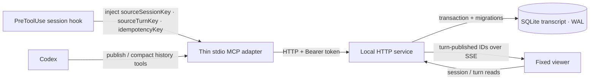

# 设计与迁移

## 目标与边界

Semantic Answer Tree 是本地、append-only 的语义答案 transcript，不是聊天系统或云端文档库。公共答案格式仍是 `SemanticAnswer` schema v1；session、turn、request summary、身份、idempotency、存储和 transport 都属于外围协议，不能加入答案文档。

核心不变量：

- 一个 `sourceSessionKey` 映射到一个 viewer session。
- 每次成功发布只追加一个 immutable turn；turn 不做原地更新或删除。
- SQLite transaction commit 发生在 durable ack 和 `turn-published` notification 之前。
- 同一个 session 内，相同 `idempotencyKey` 和相同 envelope 返回原 ack，不追加 turn，也不重复发事件。
- 查看页是成功发布后的唯一答案面；发布无法确认时，Codex 回到普通 conversation answer。

## 组件



本地 HTTP 服务是唯一拥有 SQLite connection、schema migration、runtime validation、legacy import 和 event delivery 的进程。MCP server 只把 stdio tool call 转为经过认证的 HTTP 请求，不直接打开数据库。

HTTP 服务固定绑定 `127.0.0.1`。它是 single-user local viewer：Bearer token 保护 publish 和 agent compact-history lookup，但 viewer 的 session list、full-turn reads 与 SSE 不要求 token。Session 是组织单位，不是 tenant 或 authorization boundary；任何能在本机直接访问 loopback service 的进程都能读取完整 transcript。

## SQLite 模型

实现使用 Node.js 内置 `node:sqlite`，因此没有 native addon 依赖。当前 engine 要求 Node.js `>=22.13.0`；部分 Node.js 版本可能输出 `node:sqlite` experimental warning，这不表示 migration 或数据写入失败。

数据库启动设置：

- `PRAGMA foreign_keys = ON`；
- `PRAGMA busy_timeout = 5000`；
- `PRAGMA journal_mode = WAL`；
- `PRAGMA synchronous = FULL`。

主要记录：

| 记录 | 作用 |
| --- | --- |
| `sessions` | 以唯一 `source_session_key` 标识一条 transcript，保存标题和时间元数据。 |
| `turns` | 按 session 内递增 `sequence` 追加 request summary、canonical answer JSON、hash、source turn 和 idempotency 信息。 |
| `event_log` | 保存已 commit 的 `turn-published` 标识，用于 SSE reconnect/replay。 |
| `legacy_imports` | 记录已导入的 legacy 文件绝对路径和 content hash，防止重复导入。 |
| `schema_migrations` | 记录已成功应用的 migration version、文件名和时间。 |

`turns` 的 database trigger 阻止 `UPDATE` 和 `DELETE`。唯一约束同时保护 session sequence、session 内 idempotency key，以及非空 `sourceTurnKey`。

SQLite 保存的 request summary 与 canonical answer JSON 是明文。Append-only 约束提供历史完整性，不提供 at-rest encryption；runtime 目录仍需依赖操作系统用户边界保护。

## 写入、读取与事件

发布服务先验证、canonicalize 并 hash 完整 envelope，再进入 `BEGIN IMMEDIATE` transaction 查找或创建 session、检查 idempotency、分配下一个 sequence、写入 turn 和 event log，然后 commit。成功 ack 只包含：

```json
{
  "ok": true,
  "sessionId": "...",
  "turnId": "...",
  "sequence": 1
}
```

SSE 连接先发 `ready`，随后发送 `turn-published` 与 heartbeat。`turn-published` payload 只包含 `eventId`、`sessionId`、`turnId`、`sequence`；它不携带答案正文，查看页按 ID 读取 immutable turn。Reconnect 可用已知 event ID 回放最多 100 个 commit 后的后续事件；未知 ID 不回放。

Agent 读取上下文时先使用 compact history：`roots` 只保留 root，`frontier` 再加入一层 child resolution。只有 compact 信息不足时才读取一个完整 turn；系统不会自动加载大段历史。

Compact root 包含 `content`、`childCount` 和 `frontier` 模式下可选的一层 `children`；随附的 `answer.terms` 只保留这些节点实际引用的 definitions。

## Session identity

普通 stdio MCP 配置只定义 command、args、env 和 cwd；官方 MCP 文档没有说明它会把当前 Codex thread ID 自动加入每次 tool arguments。因此不能从 stdio process、PID、cwd、浏览器 tab 或“最新 session”推断 conversation identity。[Codex MCP 文档](https://learn.chatgpt.com/docs/extend/mcp?surface=cli)

首选方案是 bundled `integration/codex-session-hook.mjs`。仓库不安装 `hooks.json`；用户必须以绝对 Node/script path 手工配置并 trust。Codex `PreToolUse` hook 能读取 common `session_id`、turn-scoped `turn_id` 和 MCP `tool_input`，再通过 `updatedInput` 替换 arguments。[Codex Hooks 文档](https://learn.chatgpt.com/docs/hooks)

该 hook 使用：

- `sourceSessionKey = "codex:" + session_id`；
- `sourceTurnKey = turn_id`；
- `idempotencyKey = SHA-256("codex:" + session_id + ":" + turn_id)`。

`codex:` namespace 避免与手工绑定冲突。Hook 只注入标识，不读取或上传完整 transcript。

如果使用 App Server wrapper，使用稳定的 `thread.id` 作为 conversation key、`turn.id` 作为 turn key。不要把 `thread.sessionId` 当作 fork identity：官方文档说明 fork 会得到新的 `thread.id`，但持久 fork 保留 root 的 `thread.sessionId`。[Codex App Server 文档](https://learn.chatgpt.com/docs/app-server)

Hook 和 wrapper 都不可用时，才为每个 conversation 显式设置唯一的 `SEMANTIC_ANSWER_SESSION_KEY`。这是人工 binding，不会随 Codex thread 或 fork 自动变化。

## Capability token

写入和 agent history 读取通过 `Authorization: Bearer <token>` 授权。`SEMANTIC_ANSWER_TOKEN` 优先于 token file；未提供直接 token 时，服务从 `SEMANTIC_ANSWER_TOKEN_FILE` 读取，或在默认 `.semantic-answer/capability-token` 原子创建随机 token。

Token 至少 32 个非空白字符。不要把 token 放入答案、request summary、日志、仓库或 hosted bundle；优先让 HTTP 服务和 MCP adapter 共享同一个绝对 token-file path。

## Migration 与 legacy import

启动顺序是：打开数据库、设置 pragma、应用尚未执行的 `server/migrations/NNN_name.sql`；仅当 `SEMANTIC_ANSWER_LEGACY_FILE` 显式设置时，随后尝试 legacy import。每个 migration 和对应的 `schema_migrations` record 在同一个独立 `BEGIN IMMEDIATE` transaction 中写入，并在 commit 时一起 durable；失败会 rollback 并阻止服务以半迁移 schema 继续运行。

没有默认 legacy 路径；未设置 `SEMANTIC_ANSWER_LEGACY_FILE` 时不会读取任何 legacy 文件。迁移旧安装时，将该变量显式指向实际文件。导入规则：

- 文件不存在时跳过；
- JSON 或 schema v1 无效时报告 nonfatal invalid 状态，不写入 turn；
- 有效文件 canonicalize 后追加到固定 imported session；
- 同一个绝对 source path 只导入一次；
- 原文件只读，导入后不移动、不删除、不改写。

新安装只附带 synthetic `public/demo-transcript.json`，不附带 legacy answer。升级前应备份数据库；WAL 开启时，优先停止服务后复制数据库，或使用 SQLite-aware backup，而不是只复制仍在运行的主文件。

## Hosted demo 与 private data

Hosted Sites 页面只 import committed `public/demo-transcript.json`。该 fixture 是 synthetic data；local hostname 以外不会 bootstrap 本地 API 或 SSE。`.openai/hosting.json` 保持 `d1: null`、`r2: null`，所以 local SQLite 没有 hosted storage binding，也不会随 build 部署。

真实 database、`-wal`、`-shm` 和 capability token 默认位于 ignored `.semantic-answer/`。如果覆盖 runtime 或 legacy 路径，配置后的路径也必须保持 private、ignored；不要把真实 legacy 文件、database copy 或 token 放进 `public/`。

应用代码不加载 remote images、remote fonts 或 telemetry。Hosted CSP 限制 connection 和资源来源；普通 Markdown 外部链接只有在用户主动打开时才离开页面。Build pipeline 还会扫描已知 DB/token/path/canary 泄漏；这是 targeted release gate，不是对任意私密文本的完整证明。

## Failure 与恢复

- Validation failure：不 commit；Codex 根据结构化 issue 修复一次，并用同一个 idempotency key 重试一次。
- Ambiguous timeout：用完全相同的 envelope 和 idempotency key 重试；如果首次请求已 commit，服务返回原 ack，且不发第二个 event。
- Token、HTTP、migration 或 database failure：不伪造 success ack；最后一个已 commit turn 保持可读。
- 无法确认 durable ack：Codex 不输出 rendered status，改为在当前 conversation 中提供完整普通答案。
- SSE 中断：已 commit 数据仍在 SQLite；viewer reconnect 后通过 event replay 和 turn read 恢复。
