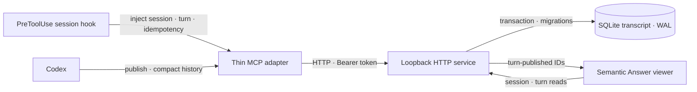

# Semantic Answer Design

## Product contract

AI answers are often too short to be useful or too long to scan. Repeated requests to explain, lengthen, or shorten the whole response force the reader to replace one fixed answer with another.

Semantic Answer instead provides one concise, complete Markdown answer and attaches optional explanation to the exact span where it may be useful.

*Read the answer. Open only the detail you need.*

The sole public answer document is `SemanticAnswer` v1:

```ts
type SemanticAnswer = {
  version: 1;
  title: string;
  body: string;
  expansions?: Record<string, {
    kind: "definition" | "detail";
    title?: string;
    content: string;
  }>;
};
```

The body links a visible span to an expansion with `[visible text](zoom:id)`. A `definition` opens as an anchored popover. A `detail` opens in a right rail on desktop or a bottom sheet on narrower screens. The reader can open only one expansion at a time.

The body is the primary reading surface and must stand alone. Conclusions, recommendations, and decision-changing caveats remain visible. Expansions add explanation, evidence, comparisons, examples, risks, implementation, or validation; they do not repair or revise the body. Expansion content cannot contain another `zoom:` link.

Opening an expansion is a local viewer action. It never calls a model.

## System boundaries

Semantic Answer is a local, append-only transcript, not a chat system or cloud document store. Source identity, request summary, idempotency, authentication, storage, and transport surround the document and must not be added to it.

Core invariants:

- One `sourceSessionKey` identifies one viewer session.
- Every successful publication appends exactly one immutable turn.
- The SQLite transaction commits before durable acknowledgement and the `turn-published` notification.
- Repeating the same `idempotencyKey` with the identical envelope in one session returns the original acknowledgement without appending or emitting again.
- The viewer is the only answer surface after confirmed publication.
- When publication cannot be confirmed, Codex gives the complete answer in the conversation and does not claim success.



The HTTP service is the only process that owns a SQLite connection, database migrations, runtime validation, and event delivery. The standard-input/output MCP adapter translates authenticated tool calls to loopback HTTP and never opens the database.

The service binds only to `127.0.0.1`. A Bearer token protects publication and agent history lookup. Viewer session lists, complete-turn reads, and events are unauthenticated loopback routes. A session organizes one user's transcript; it is not a tenant or authorization boundary. Any process that can directly reach the local service can read all turns.

## Answer validation and rendering

Validation accepts only the exact v1 fields. The title and body must be nonempty strings. Each expansion identifier uses lowercase ASCII letters, digits, `.`, `_`, and `-`; each value has `kind`, optional plain-text `title`, and nonempty Markdown `content`.

Validation scans Markdown outside code spans and fenced code blocks. Every body anchor must resolve to one expansion, and every stored expansion must be used. The same expansion may be referenced more than once. An anchor inside expansion content is rejected, keeping interaction one level deep.

`kind` is a presentation decision rather than a character-count rule:

- `definition` briefly explains what the linked phrase means in this answer.
- `detail` contains material that benefits from a larger reading surface.

The viewer sanitizes Markdown before rendering. Ordinary Markdown links remain links. Definitions are keyboard-accessible popovers; details use a fixed overlay so opening one does not move the main reading position. On small screens, the rail becomes a bottom sheet. `Copy body` copies the primary answer, while `Copy complete` includes the expansion content.

## SQLite transcript

The implementation uses Node.js `node:sqlite` and requires Node.js `>=22.13.0`. Startup configures:

- `PRAGMA foreign_keys = ON`;
- `PRAGMA busy_timeout = 5000`;
- `PRAGMA journal_mode = WAL`;
- `PRAGMA synchronous = FULL`.

Primary records:

| Record | Purpose |
| --- | --- |
| `sessions` | Identifies a transcript by unique source session and stores title and time metadata. |
| `turns` | Stores request summary, canonical answer JSON, hash, source turn, idempotency data, and a monotonically increasing per-session sequence. |
| `event_log` | Stores committed `turn-published` identifiers for event replay. |
| `schema_migrations` | Records each successfully applied database migration. |

Database triggers reject turn updates and deletions. Unique constraints protect per-session sequence, per-session idempotency key, and each nonempty source-turn key. Answers and request summaries are plaintext; immutable history is not encryption at rest.

At startup the service applies pending `server/migrations/NNN_name.sql` files in order. Each migration and its `schema_migrations` record share one `BEGIN IMMEDIATE` transaction. Failure rolls back that migration and prevents startup with a partially changed database.

This product contract starts a fresh transcript when replacing an installation that stored a different answer shape. Preserve the capability token, but replace the prior database and its write-ahead-log companions while services are stopped. The application does not transform prior answer documents.

## Publication, history, and events

Publication validates, canonicalizes, and hashes the entire envelope before entering a `BEGIN IMMEDIATE` transaction. The service finds or creates the session, checks idempotency, allocates the next sequence, writes the turn and event, and commits. Success returns only:

```json
{
  "ok": true,
  "sessionId": "...",
  "turnId": "...",
  "sequence": 1
}
```

Compact agent history includes each answer's `version`, `title`, and `body`, without expansion content. An agent starts with a small compact page and reads at most one complete turn when the missing expansion content is necessary.

An event connection emits `ready`, then `turn-published` events and heartbeats. A publication event contains only `eventId`, `sessionId`, `turnId`, and `sequence`; the viewer reads the committed turn by ID. Reconnection from a known event ID can replay at most 100 later events. An unknown ID triggers no replay.

## Session identity and temporary side chats

A standard-input/output MCP process must not be treated as one conversation. Identity cannot be inferred from process ID, working directory, browser tab, or the most recent session.

The bundled `PreToolUse` hook injects:

- `sourceSessionKey = "codex:" + session_id`;
- `sourceTurnKey = turn_id`;
- `idempotencyKey = SHA-256("codex:" + session_id + ":" + turn_id)`.

The `codex:` namespace separates Codex identities from manual bindings. The hook reads only supplied identifiers and tool input; it does not read or upload transcripts.

When a one-off side chat has `turn_id` but no stable `session_id`, the hook derives a hashed source key in the disjoint `codex-temporary:v1:` namespace. Requests within that turn remain stable across tool-use identifiers and retries. Different turns remain separate, and the side chat never impersonates or merges into a main task.

Session responses expose only `temporary: true` for this namespace, not the source key. The viewer displays `Temporary`. The label describes identity scope, not automatic deletion; the turn remains append-only.

An App Server wrapper should use `thread.id` as the conversation key and `turn.id` as the turn key. A manually configured `SEMANTIC_ANSWER_SESSION_KEY` is a last resort and does not follow tasks or forks automatically.

## Authentication and delivery

Writes and agent history reads use `Authorization: Bearer <token>`. `SEMANTIC_ANSWER_TOKEN` takes precedence over the token file. Otherwise, the service reads `SEMANTIC_ANSWER_TOKEN_FILE` or atomically creates a random token beside the default database.

The token must contain at least 32 non-whitespace characters. Never place it in an answer, request summary, log, repository, browser-exposed variable, or hosted bundle. Configure the HTTP service and MCP adapter to use the same absolute token path.

The adapter gives each loopback publication attempt a ten-second deadline. If delivery is ambiguous, it retries once with the exact serialized envelope and idempotency key. A first request that committed will therefore return its original acknowledgement instead of creating another turn.

## Hosted demonstration and private data

The hosted Sites build imports only synthetic `public/demo-transcript.json`. Outside a local hostname, the viewer does not connect to the local API or event stream. `.openai/hosting.json` keeps `d1: null` and `r2: null`, so local SQLite has no hosted storage binding.

The database, `-wal` and `-shm` companions, and capability token stay in the ignored `.semantic-answer/` directory by default. The application loads no remote images, remote fonts, or telemetry. Its content security policy restricts connection and resource origins. The build also scans for known database, token, path, and canary leaks; that focused check is not proof that arbitrary private text cannot enter a bundle.

## Failure behavior

- Invalid document: nothing commits. Codex may repair the reported issue once.
- Ambiguous delivery: the adapter retries once with the identical envelope.
- Token, HTTP, database, or migration failure: no success acknowledgement is fabricated; the last committed turn remains readable.
- Missing durable acknowledgement: Codex gives the complete answer in the conversation and does not output `Rendered in Semantic Answer.`
- Event interruption: committed data remains in SQLite and is recovered through replay and turn reads.
